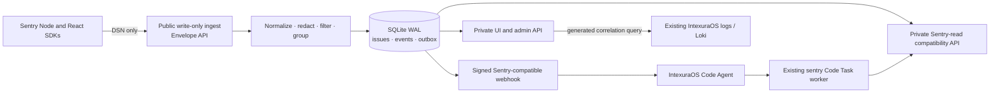

# SentryBox — Product and Architecture Specification

| Field | Value |
| --- | --- |
| Status | Implemented MVP; SentryBox identity migration in progress |
| Date | 2026-07-28 |
| Repository | `pbuchman/sentrybox` |
| Deployment target | Home Dev |
| Product scope | Independent self-hosted tracking for multiple projects |

## 1. Executive decision

SentryBox is an independent, self-hosted, Sentry-compatible error tracker for
multiple applications and projects. Each configured project/environment pair
receives its own standard Sentry-compatible DSN. An application that already
uses a Sentry SDK can report to SentryBox by changing only that DSN; its SDK
capture and logging call sites remain unchanged.

The first bundled deployment is the IntexuraOS integration on Home Dev. It uses
SentryBox to:

1. receive application warnings, errors, and fatal events through the existing Sentry SDKs;
2. normalize, redact, retain, and group occurrences into issues;
3. filter issues by project, project version, environment, service, severity,
   time, and lifecycle status;
4. inspect and download issue events;
5. resolve, reopen, and permanently delete issues;
6. correlate an occurrence with the existing full IntexuraOS logs;
7. send the same signed webhook contract currently consumed by Code Agent;
8. provide the issue evidence required by the existing autonomous Sentry worker.

The application does not become a general log store and does not recreate
Sentry performance monitoring, tracing, replay, metrics, release management,
source-map hosting, user management, or arbitrary alert rules.

## 2. Confirmed requirements

### 2.1 Included

- Store only `warning`, `error`, and `fatal` events. The internal canonical
  names are `warn`, `error`, and `fatal`.
- Accept the Sentry DSN and Envelope protocol used by `@sentry/node@8.55.0`
  and `@sentry/react@8.55.0`.
- Make application migration a DSN value change. No service-by-service logger
  rewrite is required.
- Treat the DSN project identity as the canonical project tag.
- Treat Sentry `release` as the canonical project version.
- Treat Sentry `environment` as the canonical environment.
- Retain `service`, SDK tags, stack traces, breadcrumbs, contexts, and a
  bounded set of extra fields after server-side redaction.
- Group repeated occurrences deterministically.
- Keep first-seen, last-seen, total count, matching-filter count, and recent
  occurrence timestamps unambiguous.
- Support JSON for one event and streaming NDJSON gzip for issue or filtered
  exports.
- Send a webhook when an issue is created and when a resolved issue regresses.
- Keep the existing Code Agent route, signature, `agentType: "sentry"`, worker
  type preference, task context, and completion contract.
- Expose the UI, private API, and worker read API only through Tailscale.
- Require no application-level login for the UI.
- Retain data for at most 30 days and keep all runtime data within a 5 GiB
  physical storage budget. Both limits are fixed product safety boundaries,
  not user-configurable settings.

### 2.2 Explicit non-goals

- Persisting `trace`, `debug`, or `info` logs.
- Replacing Grafana Loki or the current full-log pipeline.
- Generic multi-tenant SaaS operation.
- User accounts, Auth0, roles, teams, or per-user permissions.
- Sentry transactions, spans, performance traces, sessions, profiles, replays,
  feedback, attachments, minidumps, or security-report ingestion.
- Source-map upload or source-code integration in the first release.
- Arbitrary query languages or alert-rule builders.
- Automatic issue resolution when a pull request is created or merged.
- Renaming the existing IntexuraOS `sentry` task contracts during migration.

## 3. Bundled Home Dev integration

The bundled sample and initial cutover are based on the following verified
IntexuraOS behavior:

- All backend loggers already pass through `@intexuraos/infra-sentry`.
- The Pino transport sends levels 40, 50, and 60 through the Sentry Node SDK.
- Backend initialization already sends `environment`, `release`, and
  `serverName`; Pino structured fields become Sentry `extra` fields.
- React already initializes the Sentry SDK with DSN, environment, and release.
- The current JavaScript SDKs resolve to version 8.55.0.
- The SDK sends event envelopes to `/api/{numericProjectId}/envelope/`.
- The Code Agent webhook verifies a raw-body HMAC-SHA256 signature and accepts
  `issue` and `event_alert` resources.
- Code Agent chooses `defaultSentryWorkerType`, creates `agentType: "sentry"`
  tasks, and passes a `sentryIssue` context to the orchestrator.
- The worker currently fetches issue details and events through the official
  Sentry MCP server and completes with `SENTRY_AGENT_FINAL`.
- Dev and production already ship complete PM2 logs to Grafana Loki. SentryBox
  therefore needs a locator into those logs, not another copy of them.
- Current read-only Home Dev evidence shows 581 GiB free on a 915 GiB root
  filesystem at 34% used. The 5 GiB limit remains a fixed safety boundary, not
  a target size.

The Home Dev sample starts with two IntexuraOS logical projects. Environment is
deliberately not encoded in the project name:

| Home Dev project slug | Application surface | Environments |
| --- | --- | --- |
| `intexuraos-backend` | all backend services and workers | `dev`, `prod` |
| `intexuraos-web` | React web application | `dev`, `prod` |

Local execution continues to report with the existing `dev` environment label.
The `service` facet distinguishes individual backend services. During shadow
forwarding, `(project, environment)` selects the corresponding one of the four
legacy Sentry DSNs.

Each configured project/environment pair receives its own Sentry-compatible
DSN. In this sample, each logical project has one ingest credential restricted
to `dev` and another restricted to `prod`, producing four DSNs without splitting
the two projects. The environment in an event is client-controlled, so it is
accepted only when it exactly matches the environment bound to the DSN key.
This prevents a public browser DSN from selecting a production Code Agent route.

## 4. System architecture



One process serves two listeners:

| Listener | Bind | Exposure | Allowed surface |
| --- | --- | --- | --- |
| ingest | `127.0.0.1:8140` | Cloudflare Tunnel public hostname | envelope ingest, OPTIONS, minimal health |
| private | `127.0.0.1:8141` | Tailscale Serve HTTPS on port 8443 | UI, read/admin API, downloads, worker compatibility API, full health |

The separation is enforced by two Fastify instances with independent route
registration. The public listener must not register read, search, download,
resolve, delete, webhook-administration, or worker endpoints.

## 5. Sentry-compatible reporting

### 5.1 DSN contract

Each configured `(project, environment)` pair receives a random public key and
its own standard Sentry-compatible DSN. Keys for the same logical project use
the same numeric project ID, so grouping and filtering still see one project.
Applications can adopt the DSN without changing their existing Sentry SDK call
sites. The DSN is:

```text
https://<public-key>@<public-ingest-host>/<numeric-project-id>
```

The JavaScript SDK derives this endpoint:

```text
POST /api/<numeric-project-id>/envelope/?sentry_version=7&sentry_key=<public-key>&sentry_client=<sdk>
```

The public key is an identifier and abuse-control input, not a secret. SentryBox
accepts an event only when project ID and public key map to the same enabled
project and the event environment matches the environment bound to that key.
Project identity and routing environment from event tags are never trusted over
the DSN mapping. An environment mismatch is rejected before persistence,
forwarding, or outbox creation.

### 5.2 Supported transport behavior

The first release supports:

- newline-framed Sentry envelopes;
- requests with or without `Content-Type`;
- identity and gzip request bodies;
- decompressed request size up to 1 MiB;
- envelope item type `event`;
- idempotency by `(project_id, event_id)`;
- Sentry-style `200`, `400`, `413`, and `429` responses;
- browser CORS for an exact configured origin allowlist;
- optional migration forwarding to the original Sentry DSN.

SentryBox parses all item headers but returns success while discarding unsupported
`transaction`, `span`, `session`, `sessions`, `client_report`, and unknown item
types. This prevents the existing SDK from retrying intentionally unsupported
telemetry. Binary item types and attachments are rejected at the item level and
never stored.

Legacy `/store/`, minidump, Unreal, security report, feedback, replay, and
attachment endpoints are not required by the verified IntexuraOS SDK traffic.

### 5.3 Severity admission

An `event` is stored when either condition applies:

1. `level` is `warning`, `error`, or `fatal`;
2. `level` is absent and the event contains a non-empty exception interface,
   in which case the canonical level is `error`.

Events with `trace`, `debug`, `info`, or an unsupported level receive a normal
2xx response and increment a discard metric. They are not persisted.

### 5.4 Normalization and redaction

SentryBox normalizes and stores only bounded data required for diagnosis:

- exception type, value, mechanism, and frames;
- formatted message and logger;
- at most 100 breadcrumbs;
- environment, release, server name, platform, SDK, runtime, and user-defined tags;
- request method and sanitized URL without credentials or sensitive query values;
- trace, request, task, session, and correlation identifiers when present;
- redacted contexts and extra data;
- original event timestamp and SentryBox receive timestamp.

Before any database write, recursive server-side redaction removes values under
case-insensitive keys matching credentials, authorization, cookies, tokens,
passwords, secrets, API keys, request bodies, user-authored content fields, and
`contentPreview`. Top-level error messages and exception values remain diagnostic
after secret-pattern redaction and size limits. Header allowlisting keeps only
diagnostic headers such as method, host, content type, user agent, trace, and
request ID. SentryBox never stores the unredacted request body.

Limits after normalization:

| Field | Limit |
| --- | --- |
| message/title | 4 KiB each |
| exception frames | 200 |
| breadcrumbs | 100 |
| individual tag key/value | 200 B / 1 KiB |
| tags | 100 |
| normalized event JSON | 512 KiB |
| recursion depth | 8 |

Truncation is explicit in stored metadata and visible in the event UI.

### 5.5 Migration-only shadow forwarding

Shadow forwarding is configured only by the trusted `(project, environment)`
ingest-key record. After project/key/environment validation, SentryBox may relay
the original envelope to that record's fixed legacy Sentry DSN. It rewrites the
transport endpoint and DSN authentication, preserves event IDs and item bytes,
and never accepts a destination from the event or request.

Forwarding uses a bounded in-memory queue and is best effort: it never persists
the unredacted envelope and never changes the SDK response. Success, failure,
queue saturation, latency, and target environment are counted for the shadow
comparison. Forwarding is disabled permanently after cutover.

## 6. Canonical event model

```ts
type ErrorLevel = 'warn' | 'error' | 'fatal';

interface ErrorEvent {
  id: string;                 // SDK event_id
  issueId: string;
  projectId: number;
  projectSlug: string;        // canonical project tag from DSN
  environment: string;        // SDK environment
  release: string | null;     // project version
  service: string | null;     // server_name or explicit service tag
  level: ErrorLevel;
  platform: string | null;
  title: string;
  message: string | null;
  exceptionType: string | null;
  culprit: string | null;
  occurredAt: string;
  receivedAt: string;
  requestId: string | null;
  traceId: string | null;
  taskId: string | null;
  fingerprintVersion: 1;
  fingerprint: string;
  tags: Record<string, string>;
  payload: RedactedEventPayload;
  payloadBytes: number;
  truncated: boolean;
}
```

`project`, `release`, and `environment` are first-class indexed columns and are
also returned in the tags view. The UI label for `release` is **Version**.

## 7. Grouping

### 7.1 Group scope

Issues are grouped within a project:

```text
issue key = project_id + fingerprint_version + fingerprint
```

Environment and release are facets, not grouping keys. The same underlying bug
can therefore be inspected across environments and versions without losing the
ability to filter to a single environment or release.

### 7.2 Fingerprint version 1

Precedence:

1. If the event has a non-default explicit Sentry fingerprint, hash the ordered
   fingerprint values with exception type and service.
2. For exceptions, hash exception type, normalized exception message, service,
   and up to five most relevant application frames.
3. For warning messages, hash logger, service, and normalized message template.

Frame identity uses module, filename, and function. It excludes line and column
numbers so a new release does not fragment an unchanged failure. Vendor frames,
absolute build roots, query strings, UUIDs, 32/40/64-character hashes, timestamps,
and standalone numeric identifiers are normalized before hashing.

The raw fingerprint input and algorithm version are stored for explainability.
Changing the algorithm creates a new version; existing issues are never silently
re-keyed.

### 7.3 Idempotency versus grouping

SDK/network retries with the same event ID are idempotent and do not increase
the occurrence count. Two captures with different event IDs remain two
occurrences even when they group into one issue. This deliberately avoids unsafe
heuristic loss. The existing Fastify double-capture behavior therefore produces
one issue with two occurrences, not two issues.

## 8. Issue lifecycle

States are `unresolved` and `resolved`.

- A new fingerprint creates an unresolved issue. When its environment-specific
  webhook destination is `live`, the same transaction enqueues one `created`
  webhook. When the destination is `disabled`, it records a permanently
  `suppressed` transition instead.
- Additional occurrences update counts and facets without another webhook.
- **Resolve** changes the state and records `resolved_at`.
- A new occurrence for a resolved issue atomically reopens it and increments its
  generation. It enqueues one `regressed` webhook in `live` mode or records one
  permanently `suppressed` regression transition in `disabled` mode.
- **Reopen** manually returns a resolved issue to unresolved without sending a
  Code Agent webhook.
- **Delete permanently** removes the issue, all occurrences, facets, and pending
  webhook deliveries in one transaction. The UI states that deletion cannot be
  undone. A later matching event creates a new issue and generation.

SentryBox does not infer resolution from pull-request state. Code fixes and issue
lifecycle remain separate explicit operations.

## 9. Correlation with full IntexuraOS logs

SentryBox does not ingest `info` or `debug` logs. It builds a locator from fields
already present in Sentry events produced by the shared Pino transport:

1. an exact Pino-extra correlation field, preferring `requestId`, then
   `taskId`, then an explicitly logged `traceId`;
2. service, environment, and exact original log timestamp;
3. normalized message and a ±2 minute time window as fallback.

Every event view contains:

- **Open matching logs**, using a configured Grafana/Loki URL template;
- **Copy LogQL query**;
- the exact time range, service, environment, and identifiers used;
- an explanation when a browser-only event is not expected to have a server log.

SDK-generated `contexts.trace.trace_id` values are retained as diagnostic
context but are not treated as log identifiers because they are not present in
the original Pino line. The generated query matches the complete correlation
field/value token in either PM2 text or production Pino JSON. It never claims an
exact match when only the timestamp/message fallback is available.

Changing only the DSN cannot retroactively place a new SentryBox event ID into the
already-written Pino line. Guaranteed one-to-one event IDs are therefore not an
MVP requirement. A later shared-transport enhancement may write one correlation
ID to both outputs without changing individual services.

## 10. Webhook compatibility

### 10.1 Code Agent destination

Webhook destinations are configured per `(project, environment)` so environment
ownership is preserved:

- dev/local projects route to the dev Code Agent;
- production projects route to the production Code Agent.

Each destination has its own URL and HMAC secret loaded from the runtime
credential file. Secrets are never stored in SQLite or exposed by the UI.

### 10.2 Exact request contract

```http
POST /api/code/webhooks/sentry HTTP/1.1
Content-Type: application/json
Sentry-Hook-Resource: event_alert
Sentry-Hook-Signature: <lowercase 64-character hex HMAC-SHA256 of raw body>
X-Error-Hub-Delivery: <stable delivery UUID>
```

Created payload:

```json
{
  "action": "triggered",
  "data": {
    "event": {
      "event_id": "4f7a4f2c0e8e4c2a9c3d5e7f90123456",
      "title": "TypeError: Cannot read properties of undefined",
      "web_url": "https://<private-hub-host>:8443/organizations/intexuraos/issues/1042/events/4f7a4f2c0e8e4c2a9c3d5e7f90123456/",
      "issue": {
        "id": "1042",
        "shortId": "INTEXURA-HUB-1042",
        "title": "TypeError: Cannot read properties of undefined",
        "permalink": "https://<private-hub-host>:8443/organizations/intexuraos/issues/1042/",
        "status": "unresolved",
        "project": {
          "id": "1",
          "slug": "intexuraos-backend"
        }
      },
      "project": {
        "id": "1",
        "slug": "intexuraos-backend"
      }
    }
  }
}
```

Creation and regression both use `event_alert.triggered`. SentryBox's internal
generation governs exactly-once outbox creation, while the payload's stable
`event_id` identifies the external transition and remains unchanged on retry.
The corrected Code Agent reservation uses that event ID and stable issue ID; no
non-Sentry payload field is required. The issue status remains `unresolved`.
The permalink shape is mandatory because the current Code Agent parser extracts
organization and issue identity from `/organizations/{org}/issues/{issueId}/`
on non-Sentry hosts.

### 10.3 Delivery semantics

Issue state change and outbox insertion occur in one SQLite transaction. A
background dispatcher uses this schedule:

```text
immediate, 30s, 2m, 10m, 1h, 6h, then every 12h for 7 days
```

- Any 2xx response marks a delivery successful.
- Timeouts, network failures, 408, 429, and 5xx are retried.
- 400, 401, 403, and 404 move the delivery to `dead_letter` immediately.
- A dead-letter delivery is visible on the issue and system-status screens and
  can be retried manually after configuration is corrected.
- The raw serialized body is persisted before signing, so every retry has the
  exact same bytes and signature.
- A destination has mode `disabled` or `live`. Disabled mode writes an immutable
  `suppressed` audit row that the dispatcher can never send or retry. Switching
  to live records `enabled_at` and does not release suppressed shadow history;
  only a new issue or regression committed after that instant creates a pending
  delivery. This prevents a cutover backlog flood.

Only one webhook is emitted for a new issue generation. SentryBox never sends a
webhook for every repeated occurrence. The outbox records whether its internal
cause was `created` or `regressed`, even though both Code Agent deliveries use
the compatible `event_alert.triggered` action.

## 11. Existing Code Agent and worker compatibility

### 11.1 Contracts kept unchanged

The initial migration keeps:

- route `/api/code/webhooks/sentry`;
- `Sentry-Hook-Resource` and `Sentry-Hook-Signature`;
- `agentType: "sentry"`;
- `defaultSentryWorkerType`;
- `sentryIssue` task context;
- `SENTRY_AGENT_FINAL`;
- result fields such as `sentry_outcome` and `sentry_issue_url`;
- exact issue URL equality validation on completion.

Renaming these provider-specific fields is not required to replace Sentry and is
outside the migration scope.

### 11.2 Required Code Agent reliability prerequisite

Before enabling SentryBox webhooks, the Code Agent reservation must become a retryable
state machine. The current flow can permanently wedge when it reserves a webhook
before task creation, and its problem-level dedupe depends on title rather than a
stable issue identity.

The migration changes only this boundary:

- transition identity for SentryBox alerts: organization + project + issue ID +
  payload event ID, with the existing legacy fallback for old Sentry payloads;
- reservation states: `reserved`, `task_created`, `failed`;
- a bounded lease allows retry after a crashed reservation;
- an active task or an open pull request blocks duplicates;
- a merged/closed prior task does not block a later regression generation;
- the SentryBox delivery ID is recorded for audit but issue identity controls dedupe.

No general queue, Linear, dispatcher, or completion refactor is included.

### 11.3 Worker evidence API

To minimize worker changes, SentryBox exposes only the Sentry REST read subset
required by the pinned official MCP client:

```text
GET /api/0/organizations/{org}/issues/{issueId}/
GET /api/0/organizations/{org}/issues/{issueId}/events/latest/
GET /api/0/organizations/{org}/issues/{issueId}/events/{eventId}/
GET /api/0/organizations/{org}/issues/{issueId}/events/
GET /api/0/projects/{org}/{projectSlugOrId}/
```

Responses contain the Sentry-compatible issue/event fields used by
`get_issue_details` and `search_issue_events`: issue identity, project, status,
frequency, first/last seen, culprit, event entries, exception frames,
breadcrumbs, tags, contexts, environment, release, and timestamps.

The worker configuration pins `@sentry/mcp-server@0.37.0`, sets its self-hosted
host to the private SentryBox hostname, and disables unsupported Seer functionality.
SentryBox CI runs a compatibility test through that pinned MCP version. Upgrading
the MCP package requires this test to pass before changing the pin.

This is a compatibility facade, not a commitment to implement the complete
Sentry API. Unsupported endpoints return a structured 404.

During migration, the worker keeps the existing Sentry MCP entry for historical
Sentry tasks and adds a SentryBox-specific MCP entry. The prompt chooses by issue URL
host. After all historical tasks are terminal, the old entry and SaaS token may
be removed in a separate cleanup.

SentryBox container is never attached to the privileged Code Worker Docker
network. Before enabling automation, a disposable real worker container must
prove HTTPS access to the private Tailscale hostname. If the existing bridge
cannot route to the host tailnet address, deployment adds a narrow host gateway
route for the worker; it does not expose or attach the SentryBox admin listener to the
worker network.

## 12. Private HTTP API

All routes below exist only on the private listener.

| Method | Route | Purpose |
| --- | --- | --- |
| `GET` | `/api/issues` | cursor-paginated issue list and facets |
| `GET` | `/api/issues/{id}` | issue summary and facet distributions |
| `GET` | `/api/issues/{id}/events` | cursor-paginated occurrences |
| `GET` | `/api/events/{id}` | one normalized event |
| `POST` | `/api/issues/{id}/resolve` | resolve issue |
| `POST` | `/api/issues/{id}/reopen` | manually reopen issue |
| `DELETE` | `/api/issues/{id}` | permanent transactional deletion |
| `GET` | `/api/events/{id}/download` | one JSON event |
| `GET` | `/api/issues/{id}/download` | streaming NDJSON gzip issue export |
| `GET` | `/api/export` | streaming filtered NDJSON gzip export |
| `GET` | `/api/facets` | filter values and counts |
| `GET` | `/api/system/status` | storage, retention, ingest, outbox health |
| `POST` | `/api/webhook-deliveries/{id}/retry` | retry a dead-letter delivery |
| `GET` | `/metrics` | private Prometheus operational metrics |
| `GET` | `/health/live` | process liveness |
| `GET` | `/health/ready` | database and storage readiness |

Issue list filters are shareable URL query parameters:

```text
project, release, environment, service, level, status, from, to, query
```

Repeated facet parameters use OR within one facet and AND across different
facets. Cursor pagination is stable on `(last_seen, issue_id)` for issues and
`(occurred_at, event_id)` for events.

An event without `release` appears under the explicit **Unknown version** facet
value. It is selectable and shareable like any other version, but remains `null`
in API and export payloads rather than inventing a release identifier.

## 13. Storage model

SQLite runs in WAL mode with foreign keys, busy timeout, WAL auto-checkpoint,
incremental auto-vacuum, and one application writer.

Core tables:

| Table | Responsibility |
| --- | --- |
| `projects` | numeric DSN ID, slug, name, enabled state |
| `project_ingest_keys` | public-key hash, project, allowed environment, CORS allowlist, forwarding/webhook routes |
| `issues` | fingerprint, title, status, generation, counts, first/last seen |
| `events` | indexed facets, correlation fields, compressed redacted payload |
| `event_tags` | arbitrary sanitized SDK tag key/value pairs |
| `issue_facets` | per-issue environment/release/service/level counts and last seen |
| `webhook_outbox` | immutable body, destination, state, attempts, next attempt |
| `schema_migrations` | ordered database migrations |

The database stores normalized payload JSON compressed with gzip. Filters never
depend on decompressing payloads; all required facets have indexed columns or
normalized facet rows.

## 14. Retention and disk safety

The live runtime data directory has a fixed, non-configurable 5 GiB total budget
including database, WAL, and temporary database files. Event retention is also
fixed at 30 days and is not user-configurable. Retained backups require an
external-backed destination and are not accumulated on the root filesystem.

- Events older than 30 days by `received_at` are removed hourly.
- Each deletion batch atomically recomputes retained issue counts, first/last
  seen, highest level, and environment/release/service facets from remaining
  events. All UI counts and times describe the retained window, never deleted
  history.
- Delivered outbox rows are removed after 7 days.
- Logical event payload data has a 4 GiB high-water mark, reserving 1 GiB for
  SQLite/WAL/maintenance overhead.
- When the high-water mark is crossed, the sweeper deletes oldest events in
  bounded batches until data falls below 3.6 GiB.
- Empty issues are removed after their last event is deleted.
- Incremental vacuum and WAL checkpoint run after retention batches.
- If physical usage reaches 4.75 GiB and cleanup cannot reduce it, ingest returns
  503 and raises a visible critical health state rather than filling Home Dev.
- Downloads stream directly and never create export files in the data volume.

The system-status view shows physical bytes, logical payload bytes, oldest event,
last retention run, removed events, and whether ingest is accepting traffic.

## 15. UI and interaction design

### 15.1 Single job and information hierarchy

The UI serves one operator answering three questions:

1. What is failing now?
2. Is it the same problem or a new problem?
3. What exact event and full logs explain it?

There is no marketing dashboard. The opening screen is the unresolved issue
list with filters and explicit last-seen times.

### 15.2 Visual system

The interface uses a restrained operational palette:

| Token | Value | Use |
| --- | --- | --- |
| `canvas` | `#F5F7FA` | page background |
| `surface` | `#FFFFFF` | panels and rows |
| `ink` | `#17212B` | primary text |
| `muted` | `#637381` | secondary metadata |
| `warn` | `#A86516` | warnings |
| `error` | `#B8322A` | error/fatal states |
| `resolved` | `#23745D` | resolved state |
| `focus` | `#1668C7` | keyboard focus and links |

Atkinson Hyperlegible is bundled for interface text; JetBrains Mono is bundled
for identifiers, stack traces, JSON, and LogQL. The signature element is a thin
left-hand **signal spine** on each issue row: its color shows the highest
severity and its segmented density communicates recent recurrence without a
decorative chart.

The UI has no gradients, glass effects, decorative animation, or ambiguous icon-
only actions. Motion is limited to 150 ms state transitions and is disabled by
`prefers-reduced-motion`.

### 15.3 Issue list

Desktop:

```text
┌ SentryBox ───── Unresolved 24 ───── Storage 1.8 / 5 GiB ┐
│ Project ▾  Version ▾  Environment ▾  Service ▾  Level ▾  Search │
├──┬───────────────────────────────────────────┬──────┬────────────┤
│▌ │ TypeError: cannot read ...               │ 143  │ 2 min ago  │
│▌ │ prod · abc123 · whatsapp-service         │      │ 12:35:48Z │
├──┼───────────────────────────────────────────┼──────┼────────────┤
│▌ │ Worker request timed out                 │  18  │ 21 min ago │
│▌ │ dev · def456 · code-agent                │      │ 12:16:04Z │
└──┴───────────────────────────────────────────┴──────┴────────────┘
```

The list shows title, highest level, project, matching environments/versions,
service, matching count, total count when different, first seen, and last seen.
Relative time refreshes every 30 seconds. Exact UTC time remains visible on the
row and full ISO time is available in the accessible tooltip. Data never appears
timeless or permanently current.

On mobile, filters move into a sheet and each issue becomes a card. No horizontal
table scrolling is required.

### 15.4 Issue detail

The header contains status, title, project, count, first seen, last seen, and
buttons: **Resolve**, **Reopen**, **Download**, and **Delete permanently**.

Below it:

1. latest occurrence with exception and application frames first;
2. project/version/environment/service/level facet chips;
3. **Open matching logs** with the generated correlation evidence;
4. breadcrumbs in chronological order;
5. redacted contexts and extras;
6. occurrence list with exact timestamp, version, environment, and service;
7. webhook delivery state for created/regressed generations;
8. collapsed normalized JSON.

The delete dialog names the number of events to be removed and states that the
operation has no undo. Empty states explain why no server log is expected or why
a filter has no matching events. Failure messages name the failed action and the
next recovery action.

### 15.5 Accessibility

- WCAG 2.2 AA color contrast.
- Full keyboard navigation and visible focus.
- Semantic table on desktop and semantic article list on mobile.
- Severity is never communicated by color alone.
- Stack frames and JSON are selectable and horizontally scroll only inside their
  own code panel.
- Destructive actions require a labelled confirmation dialog.
- All times use `<time datetime="...">` and have an exact textual value.

## 16. Security and privacy

### 16.1 Network boundary

- UI, private API, downloads, and worker reads are available only through
  Tailscale Serve and tailnet ACLs.
- There is no app login, cookie session, or bearer token for human UI access.
- Destructive private API requests require JSON content type and an exact
  allowed `Origin`/`Host`; simple cross-site form requests are rejected.
- SentryBox application's public exposure is restricted to the ingest
  listener and minimal liveness. The separately supervised deployment handler
  has one independently filtered GitHub webhook route described in section 18.
- Public ingest cannot read whether a project, issue, or event exists.

### 16.2 Public ingest abuse controls

- Exact project ID/public-key match.
- Exact browser origin allowlist.
- Per-project and per-source rate limits with short bursts.
- One MiB decompressed-body limit and bounded decompression ratio.
- Request timeout and bounded concurrent parsing.
- No reflection of event payloads in errors.
- Cloudflare rate-limit/WAF rules in front of the listener.

### 16.3 Secrets

Runtime secrets live in `/home/pbuchman/services/sentrybox/env`, owned
by the deployment user and mode `0600`. Cloudflare tunnel credentials use a
separate credential file and never appear inline in a systemd `ExecStart`,
repository file, process listing, or diagnostic command output.

At startup, `ERROR_HUB_ENV_FILE=/run/secrets/error-hub-env` is parsed once as a
strict `KEY=VALUE` file. Non-secret project configuration refers to secret names,
for example `CODE_AGENT_HMAC_BACKEND_PROD`, rather than values. A typed resolver
fails readiness on a missing, duplicate, empty, or unreferenced required secret
and returns values only to the webhook signer or migration forwarder. Secret
values are excluded from config dumps, API responses, metrics, and logs.

The public repository contains only `.env.example` names and non-secret public
DSN examples.

## 17. Reliability and self-observability

- Ingest is fail-open for applications: telemetry failure never changes an
  application response or logger result.
- `/health/live` checks only process liveness.
- `/health/ready` checks SQLite read/write, retention safety, data directory free
  space, and migration completion.
- Structured service logs go to journald with a distinct syslog identifier.
- Prometheus metrics are private and cover accepted/discarded/rejected events,
  grouping, latency, database size, retention, and webhook states.
- The service does not report its own errors back into its own ingest pipeline.
- SQLite schema changes are forward migrations executed under an exclusive
  deployment lock.

Backups are not used to exceed the 30-day retention contract. A daily consistent
SQLite backup copy is scrubbed of event rows older than 23 days, with issue
aggregates recomputed, before it is encrypted and sent to the existing external
Home Dev backup mechanism. Seven daily generations therefore cannot retain an
event past 30 days. A monthly restore test runs retention again before readiness.
If no external backup target is configured, backup is marked disabled rather
than silently consuming the root filesystem.

## 18. Home Dev deployment

### 18.1 Build and release

The public repository uses GitHub Actions to run type checking, unit tests,
integration tests, browser tests, protocol compatibility tests, image scanning,
and a multi-stage Docker build. A successful `main` build publishes:

```text
ghcr.io/pbuchman/sentrybox:sha-<40-character-sha>
```

Production deployment always references an immutable SHA or digest, never
`latest`.

### 18.2 Home Dev layout

```text
/home/pbuchman/deploy/sentrybox/             # deployment checkout
/home/pbuchman/services/sentrybox/env         # secrets/config, mode 0600
/home/pbuchman/services/sentrybox/data/       # SQLite and WAL
/home/pbuchman/services/sentrybox/backups/    # bounded backup staging
/etc/systemd/system/sentrybox.service
/etc/systemd/system/sentrybox-deploy.service
/etc/caddy/Caddyfile.d/sentrybox.caddy         # live ingest fragment
/etc/caddy/Caddyfile.d/sentrybox-deploy.caddy  # live deploy callback fragment
```

The canonical Caddy sources are
`deploy/home-dev/caddy-sentrybox.caddy` and
`deploy/home-dev/caddy-sentrybox-deploy.caddy` in the checkout. Installation
copies them to the two live paths above. The Home Dev Caddyfile imports
`/etc/caddy/Caddyfile.d/*.caddy`; it does not import files directly from the
checkout. When `sentrybox-deploy.service` runs the deployment transaction, only
the live `sentrybox.caddy` ingest fragment is temporarily replaced with the
maintenance response and then restored from its canonical checkout source. The
live deploy callback fragment is not swapped.

The service is supervised by systemd and runs one non-root, read-only Docker
container through Docker Compose. It binds container ports only to
`127.0.0.1:8140` and `127.0.0.1:8141`, uses a 64 MiB `/tmp` tmpfs, drops all Linux
capabilities, enables `no-new-privileges`, and bind-mounts the data directory so
host Docker volume cleanup cannot delete it. The image is built on GitHub-hosted
`ubuntu-latest`, never on the Home Dev self-hosted runner.

### 18.3 Private UI exposure

Tailscale Serve exposes the private listener at HTTPS port 8443:

```bash
sudo tailscale serve --bg --https=8443 http://127.0.0.1:8141
```

Tailnet policy permits the operator and eligible Code Task worker nodes. The
actual tailnet hostname is runtime configuration and is never committed to the
public repository.

### 18.4 Public write-only exposure

A dedicated `errors.intexuraos.cloud` Cloudflare DNS/tunnel hostname routes to
Caddy. Its Caddy virtual host proxies only:

```text
/api/{projectId}/envelope/
/health/live
```

Every other route returns 404 before proxying. The public hostname never routes
to port 8141.

The Caddy contract is:

```caddyfile
errors.intexuraos.cloud:80 {
  @ingest {
    method POST OPTIONS
    path_regexp envelope ^/api/[0-9]+/envelope/$
  }

  handle @ingest {
    reverse_proxy 127.0.0.1:8140
  }

  handle /health/live {
    reverse_proxy 127.0.0.1:8140
  }

  handle {
    respond "not found" 404
  }
}
```

### 18.5 Deployment transaction

1. Pull the immutable image and record the currently running digest.
2. Run configuration validation and a read-only database preflight.
3. Replace only `/etc/caddy/Caddyfile.d/sentrybox.caddy` with a bounded
   maintenance response `503` with `Retry-After`, so SDKs retry instead of
   treating telemetry as accepted.
4. Create a consistent pre-migration SQLite backup.
5. Start the new image; it acquires the migration lock and applies migrations.
6. Require private readiness and public synthetic-envelope success.
7. Restore the live ingest fragment from
   `deploy/home-dev/caddy-sentrybox.caddy`, reload Caddy, and observe metrics for
   ten minutes.
8. On failure, restore the previous image digest and rerun both health checks.
   Forward-compatible migrations make database reversal unnecessary; restore
   the pre-migration backup only if an integrity check proves database damage.

The initial deploy is manual. Automatic deploy then uses a separately supervised
Home Dev handler on `127.0.0.1:9003`. GitHub reaches exactly
`POST https://errors-deploy.intexuraos.cloud/github/workflow-run` through the
existing Cloudflare Tunnel and a dedicated Caddy virtual host; every other
method and path returns 404. The handler verifies the GitHub HMAC over the raw
body, rejects bodies over 1 MiB, deduplicates the GitHub delivery ID, rejects
replays older than five minutes, and accepts only a successful `workflow_run`
caused by `push` to `pbuchman/sentrybox:main` for the named release
workflow. It accepts no command from the payload and invokes one fixed, locked
deploy script for the verified SHA.

```caddyfile
errors-deploy.intexuraos.cloud:80 {
  @workflow_run {
    method POST
    path /github/workflow-run
  }

  handle @workflow_run {
    reverse_proxy 127.0.0.1:9003
  }

  handle {
    respond "not found" 404
  }
}
```

Public-repository workflows always use GitHub-hosted runners because untrusted
pull requests must never execute on Home Dev.

## 19. Migration and cutover

### Phase 0 — prerequisites

1. Deploy SentryBox with every Code Agent destination in `disabled` mode.
2. Configure the two logical projects, four environment-bound ingest keys,
   four `(project, environment)` legacy forwarding routes, and
   environment-specific Code Agent targets.
3. Verify public browser CORS and private Tailscale access.
4. Run protocol tests using the exact Node and React SDK versions.
5. Implement and deploy the Code Agent reservation reliability fix.
6. Add the SentryBox worker MCP/read configuration while retaining the SaaS Sentry MCP.
7. Prove a synthetic SentryBox issue can be fetched by a real worker without creating
   a production Code Task.

### Phase 1 — dev shadow traffic

1. Change only the dev backend and dev web DSN values to SentryBox DSNs.
2. SentryBox stores each accepted event and asynchronously forwards its original
   envelope to the old Sentry DSN.
3. Keep SentryBox Code Agent destinations disabled; suppressed shadow transitions are
   visible for audit but can never be dispatched later. Sentry remains the
   automation source.
4. Compare event IDs, fields, grouping, filtering, redaction, and log locators for
   at least 48 hours.
5. Acceptance requires no application errors caused by telemetry and no missing
   supported error event in SentryBox when it exists in Sentry.

### Phase 2 — dev automation cutover

1. Disable the Sentry webhook for the dev projects.
2. Enable SentryBox webhooks for the dev projects.
3. Emit one controlled new issue and one controlled regression.
4. Verify exactly one Linear issue and one Code Task per generation, the selected
   `defaultSentryWorkerType`, worker evidence retrieval, PR completion contract,
   and webhook outbox success.
5. Keep Sentry forwarding enabled for rollback evidence.

### Phase 3 — production shadow and cutover

1. Rebuild the production web bundle with the SentryBox web DSN and change the
   production backend DSN secret.
2. Keep production SentryBox destinations in `disabled` mode and forward to Sentry
   for 48 hours.
3. Compare volume, group identity, release/environment/project filters, and
   storage growth against the 5 GiB forecast.
4. Disable the Sentry production webhook and enable the SentryBox production webhook.
5. Run the same controlled issue/regression acceptance test.

### Phase 4 — remove Sentry dependency

After seven stable days:

1. disable SentryBox-to-Sentry envelope forwarding;
2. preserve old Sentry issue links only for historical Code Tasks;
3. keep the SaaS Sentry MCP until all historical Sentry tasks are terminal;
4. remove old DSN/auth secrets from active deployment paths;
5. cancel or downgrade Sentry only after confirming no current runtime references
   the old DSNs.

### Rollback

Rollback remains available throughout shadow and cutover:

1. disable SentryBox webhooks first;
2. re-enable Sentry webhooks;
3. restore backend DSN secrets and rebuild the web bundle with the old DSN;
4. leave the dual MCP worker configuration in place;
5. retain SentryBox data for diagnosis under the normal retention policy.

No database reversal is required to restore Sentry reporting.

## 20. Endpoint changes

### Created

- Public `POST|OPTIONS /api/{projectId}/envelope/` on
  `errors.intexuraos.cloud`.
- Private issue, event, facet, download, lifecycle, outbox, system-status, and
  readiness APIs listed in section 12.
- Private Sentry-read compatibility endpoints listed in section 11.3.
- Private Tailscale UI at HTTPS port 8443.
- Public, write-only Home Dev deployment callback at
  `POST errors-deploy.intexuraos.cloud/github/workflow-run` for verified
  successful main-branch `workflow_run` events.

### Modified

- `INTEXURAOS_SENTRY_DSN` and `INTEXURAOS_SENTRY_DSN_WEB` values point to the
  SentryBox; the application call sites and SDK packages remain unchanged.
- The Code Worker pins the Sentry MCP version and adds the private SentryBox host while
  retaining SaaS access during migration.
- Code Agent webhook reservation becomes leased and uses the already parsed
  event ID plus stable issue ID; its public route and payload parser remain
  unchanged.
- Home Dev Caddy, Tailscale Serve, systemd, and Cloudflare Tunnel configuration
  add the isolated SentryBox routes and service.

### Removed after stable cutover

- SentryBox-to-Sentry shadow envelope forwarding.
- Active SaaS Sentry webhooks for migrated projects.
- Active runtime references to old DSNs and, after historical tasks finish, the
  old worker Sentry token/MCP entry.

### Unchanged

- `@sentry/node` and `@sentry/react` capture APIs used by IntexuraOS.
- Shared Pino warning/error/fatal reporting behavior.
- Code Agent public route `/api/code/webhooks/sentry`.
- Raw-body HMAC-SHA256 webhook verification.
- `agentType: "sentry"`, `defaultSentryWorkerType`, `sentryIssue`,
  `SENTRY_AGENT_FINAL`, and completion result fields.
- Grafana/Loki as the full IntexuraOS log system.

## 21. Acceptance criteria

### Reporting

- Existing backend and React SDKs report after only DSN value changes.
- Gzip and uncompressed envelopes are accepted.
- Warning/error/fatal events are stored; info/debug/transactions are not.
- Project derives from DSN; release and environment remain distinct filters.
- A DSN key is accepted only for its bound environment and cannot select the
  other environment's forwarding or Code Agent destination.
- SDK retries do not duplicate an event.

### Grouping and lifecycle

- Repeated equivalent events form one issue across releases/environments.
- Resolve suppresses no data and sends no automatic completion signal.
- The first post-resolve occurrence reopens the issue and emits one regression
  webhook.
- Permanent delete removes issue and event data atomically.

### Code Agent and worker

- Code Agent accepts the SentryBox signature and payload without changing its route or
  task contract.
- One new issue generation creates at most one Code Task.
- Enabling a destination sends no suppressed shadow backlog; only later issue
  creations or regressions can create Code Tasks.
- A crashed reservation can be retried after its lease.
- The worker reads stack, tags, release, environment, frequency, and recent
  events from SentryBox and completes the existing `SENTRY_AGENT_FINAL` contract.

### UI

- Filters for project, version, environment, service, status, and level can be
  combined and shared by URL.
- First/last seen show both relative and exact time and update while the page is
  open.
- Downloads contain only redacted stored data.
- Mobile operation requires no horizontal page scrolling.
- All actions are keyboard accessible.

### Operations

- UI/read/admin endpoints are unreachable outside the tailnet.
- Public ingress exposes no read endpoint.
- Physical runtime storage stays below 5 GiB.
- Retention removes data older than 30 days.
- Failed webhook delivery is visible and retryable.
- Deployment health failure automatically follows the documented rollback path.

## 22. Risks and deliberate trade-offs

| Risk | Decision |
| --- | --- |
| Home Dev outage loses telemetry after SDK retry limits | Accepted for the first release; full logs remain the recovery source. |
| Public browser ingest can be abused | Project-key validation, CORS, rate limits, body limits, and Cloudflare controls. |
| Sentry-compatible worker API may drift | Pin MCP 0.37.0 and gate upgrades with compatibility tests. |
| SQLite file may not shrink immediately | Logical high-water mark, WAL checkpoints, incremental vacuum, and physical emergency cutoff. |
| DSN-only correlation lacks a new shared event ID | Use verified request/trace/time/message locator; do not promise false exactness. |
| Existing Code Agent reservation can wedge | Fix the isolated reservation boundary before enabling SentryBox webhooks. |
| Existing Fastify path can double-capture | Group the two events; do not risk heuristic occurrence deletion. |

## 23. Authoritative protocol references

- [Sentry transport authentication and DSN](https://develop.sentry.dev/sdk/foundations/transport/authentication/)
- [Sentry Envelope format](https://develop.sentry.dev/sdk/foundations/envelopes/)
- [Sentry Envelope item types](https://develop.sentry.dev/sdk/foundations/envelopes/envelope-items/)
- [Sentry transport responses and rate limiting](https://develop.sentry.dev/sdk/foundations/transport/)
- [Sentry JavaScript SDK 8.55.0](https://github.com/getsentry/sentry-javascript/tree/8.55.0)
- [Official Sentry MCP self-hosted support](https://github.com/getsentry/sentry-mcp)
- [Tailscale Serve](https://tailscale.com/docs/features/tailscale-serve)
- [Tailscale policy syntax](https://tailscale.com/kb/1337/policy-syntax)
- [IntexuraOS Sentry webhook route](https://github.com/pbuchman/intexuraos/blob/development/apps/code-agent/src/routes/webhooks/sentry.ts)
- [IntexuraOS webhook normalization](https://github.com/pbuchman/intexuraos/blob/development/apps/code-agent/src/infra/sentry-event-parser.ts)
- [IntexuraOS Sentry worker prompt](https://github.com/pbuchman/intexuraos/blob/development/workers/orchestrator/src/services/prompts/sentry-prompt.ts)
